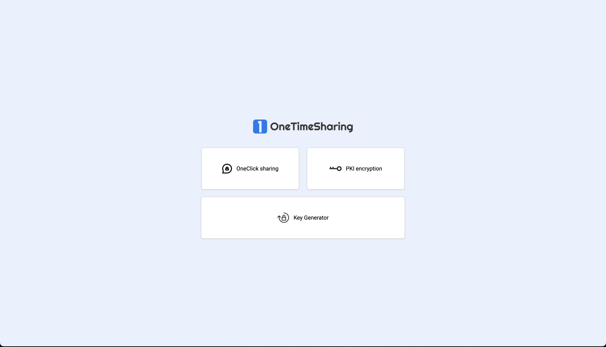

<p align="center">

</p>
<h3 align="center">Safely share your secrets.</h3>



## Introduction

Welcome to the official repository for Vanishly! This open-source project aims to provide end-to-end encryption when sharing secrets over the web. The project was made open-source to provide transparency about how your secrets will be stored/handled in the application.

## Table of Contents

- [Installation](#installation)
- [Methods](#methods)
  - [Second-half encryption](#second-half-encryption)
  - [Keypair encryption](#public-private-key-encryption)
- [Hosting](#hosting)
- [How it works](#how-it-works)
- [Contribution guide](#contribution-guide)
- [Report issues](#report-bugs-using-githubs-issues)
- [Report bugs](#write-bug-reports-with-detail-background-and-sample-code)
- [License](#license)

## Installation

Prerequisites:

- Node.JS 18.X

First of all install the dependencies in all 3 parts of the application.

Frontend:

```bash
cd app
npm install
```

Lambda handlers:

```bash
cd handlers
npm install
```

Infrastructure:

```bash
cd infra
npm install
```

### AWS CLI

When all the dependencies are installed, you need to configure the AWS CLI. First make sure you follow the guide <a href="https://docs.aws.amazon.com/cli/latest/userguide/getting-started-install.html">here</a> in order to successfully install the AWS CLI.

### AWS CLI Credentials

When the CLI is successfully installed you need to give the AWS CLI credentials so that it has access to deploy the application using this guide <a href="https://docs.aws.amazon.com/cli/latest/userguide/cli-authentication-user.html">here</a>.

### Deployment

If the AWS CLI is configured correctly, you should be able to successfully deploy the application by running the "deploy" script. This deploys a production and development environment, if you only wish to deploy one of the 2. You can use the designated scripts "deploy-prod" and "deploy-dev".

Deploy both production and development environment.

```bash
cd infra
npm run deploy
```

Deploy the production environment.

```bash
cd infra
npm run deploy-prod
```

Deploy the environment environment.

```bash
cd infra
npm run deploy-dev
```

## Hosting

This application is fully integrated with AWS. For this reason it can only be deployed on the AWS platform. You can deploy the application on your own AWS account, for this you can follow the guide here.

## How it works

The app section of the application will encrypt (based on the encryption type) the data. When the encryption is complete the app will then send the

The application is divided into 3 sections:

<b>App</b>  
 Handles the frontend (client-side) of the application. The frontend encrypts the data and sends this to the API for storage.

<b>Handlers</b>  
 These are the handlers for the Lambda functions, these will check if all the data is present for the requested encryption type and stores the secrets into the database as well as retreives them.

<b>Infra</b>  
 In this section the infrastructure is defined as code. For this the Amazon CDK is used to define all services necessary and deploy them.

## Methods

- **SHE encryption (Second half encryption)**
- **PKI encryption (Keypair encryption)**

## Second-half encryption

In this method we provide encryption using AES-256, a key and an IV is generated. When the secret is encrypted using this key. It is sent to the backend along with the second half of the encryption key. We do this so that the server does not have knowledge of the whole key and therefore cannot decrypt the secret. The only person that can decrypt it is the person with the generated URL as this stores the first half of the key along with the IV and the id to fetch and decrypt the secret. The lather is provided to the frontend using a hash parameter in the url. This parameter ensures that no data of the first half key and the id is sent in any way to any server as a hash parameter is only accessable client-side. This means that there is no way for the server or the admins of the server to decrypt the secrets that are stored. We provide this encryption type so that the receiver of the client does not need to do any work except receive and open the link.

## Public-Private key encryption

This method of encryption is a little bit more involved for the receiver of the secret. Because first of the receiver needs to go to the root directory of the application and generate a PGP keypair with a passphrase. The public key is then sent to the sender of the secret and he can use this to encrypt the secret. This generates a link with only a uuid to retrieve the secret. But this also ensures that the only person that is able to decrypt the secret is the receiver and the owner of the correct private key/passphrase combination.

## We Develop with Github

We use github to host code, to track issues and feature requests, as well as accept pull requests.

## Contribution guide

Pull requests are the best way to propose changes to the codebase. We actively welcome your pull requests:

1. Fork the repo and create your branch from main.
2. If you've added code that should be tested, add tests.
3. If you've changed APIs, update the documentation.
4. Ensure the test suite passes.
5. Issue that pull request!

## Report bugs using Github's [issues](https://github.com/becloudway/temporarysecret/issues)

We use GitHub issues to track public bugs. Report a bug by [opening a new issue](); it's that easy!

## Write bug reports with detail, background, and sample code

**Great Bug Reports** tend to have:

- A quick summary and/or background
- Steps to reproduce
  - Be specific!
  - Give sample code if you can. [This stackoverflow question](http://stackoverflow.com/q/12488905/180626) includes sample code that _anyone_ with a base R setup can run to reproduce what I was seeing
- What you expected would happen
- What actually happens
- Notes (possibly including why you think this might be happening, or stuff you tried that didn't work)

## License

MIT
