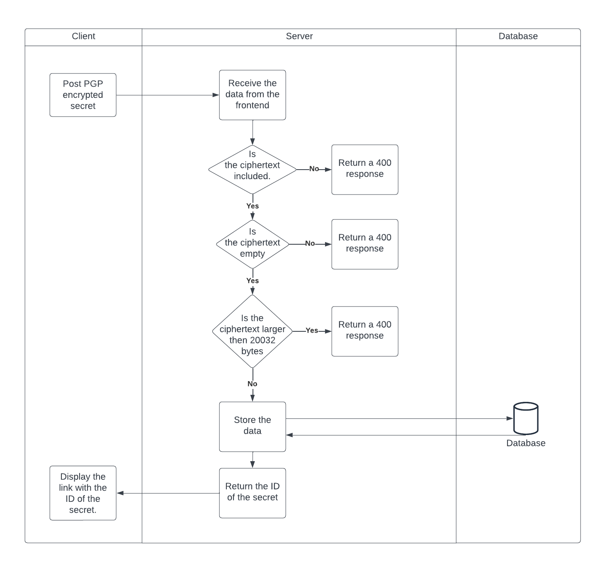
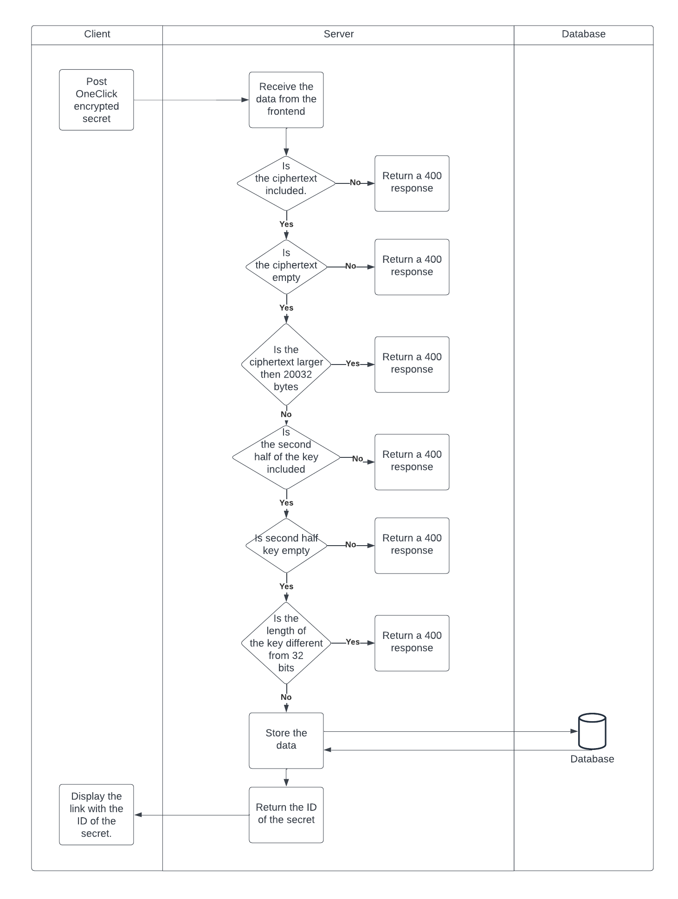
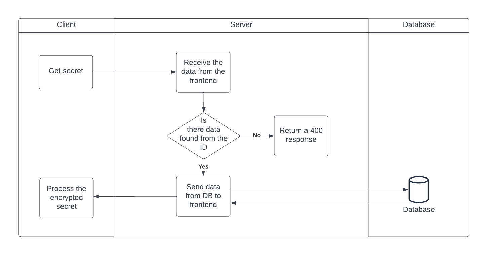

<p align="center">

</p>
<h3 align="center">Safely share your secrets.</h3>

## Technical usage guide
This guide is intended to provide more technical information about the OneTimeSharing solution. If you are just looking for a usage guide, you can find that here: [Usage Guide](USAGE_GUIDE.md)

## Table of Contents

- [Sharing and encryption types](#sharing-and-encryption-types)
  - [PGP Encrypted sharing](#pgp-encrypted-sharing)
  - [OneClick sharing](#oneclick-sharing)
- [Technical deep-dive](#technical-deep-dive)
  - [PGP Encrypted sharing deep-dive](#pgp-encrypted-sharing-deep-dive)
  - [OneClick sharing deep-dive](#oneclick-sharing-deep-dive)
  - [Server-side secret management](#server-side-secret-management)
- [Routes](#routes)

## Sharing and encryption types

OneTimeSharing has 2 options to share secrets; OneClick sharing and PGP encrypted sharing.

### PGP encrypted sharing

PGP (or Pretty Good Privacy) is an encryption system often used for both sending encrypted emails and encrypting sensitive files. It allows users who have never met to send encrypted messages to each other without exchanging private encryption keys. 

It works as follows:

1. The receiver generates a keypair (public & private key)
1. The receiver shares the generated public key with the sender
1. The sender uses the public key to encrypt the secret
1. The sender shares the encrypted secret (link) with the receiver
1. The receiver decrypts the secret using the private key

As you can see, the sharing of a secret is initiated by the receiver and 2-way communication is needed to use this sharing option.

The benefit of this option is that the private key never leaves the machine of the receiver and thus decryption of the secret can only be done by the receiver.

### OneClick sharing

As mentioned in the previous section, PGP encrypted sharing requires a bit more work and 2-way communication.

OneClick sharing was introduced as a easy option to share secrets. However, our goal remains to avoid that a secret can be decrypted by the administrators of the OneTimeSharing solution.

For this reason, we encrypt and decrypt the secrets client side which provides E2E encryption. On top of that, the encryption key is split in half. The second half is shared with the OneTimeSharing server, the first half will be part of the sharable link but will never be shared with the OneTimeSharing server.

1. The OneTimeSharing client generates an encryption key
1. The sender creates the secret (preferably with password)
1. The secret is encrypted using the created encryption key
1. The encrypted secret and the second half of the encryption key is shared with the OneTimeSharing server
1. The OneTimeSharing client generates the sharable link which includes the first half of the encryption key
1. The sender shares this link with the receiver
1. The receiver opens the link and fills in the password
1. The OneTimeSharing client receives the encryption secret and the second half of the encryption key from the OneTimeSharing server
1. The OneTimeSharing client combines both encryption key parts and decrypts the secret
1. The receiver can view the secret.


## Technical deep-dive

### PGP encrypted sharing deep-dive

Following visual explains how the OneTimesharing client and server communicate when using the PGP encrypted sharing option:



1. In this part of the flow a request is sent from the frontend to the backend, since the encryption of the secret is always handled client-side only the ciphertext needs to be sent to the backend. So the payload of the request to the server will look somthing like this.

```
{
    cyphertext: "-----BEGIN PGP MESSAGE-----wV4DruSh2egv+fgSAQdAmG5hJf32xNijfbvU9EpjrGUA7pmjQ6uSfsQzQRC/
7WwwQqdg96TXJtzOa1ymXvUhwrOVZhC5jOAcK4jbmGFADMm/IKgUMu5am2rB
xJzRusog0jUBYErYrIOIvZhRt2rdZE0XxlIIPKEwc3LP8E3rjxs1vHHQzxo9
yPEPkvELWrrPDReAQ+CsLA==
=r2D3-----END PGP MESSAGE-----"
}
```

2. Based on this response a couple of checks need to be executed, mainly about the length of the secret. We want to make sure we don't store any empty data in the database so we check if the object includes a cyphertext and also if this text is not empty. We also decided on a maximum length of 10MB so a check is used to confirm the encrypted version of this text does not exceed 20MB.
2. If these checks pass, the cyphertext is stored in the database and the ID of this record is returned.
2. This ID is returned to the frontend and is used to generate a link to the decryption page with this ID in the URL parameters.

### OneClick sharing deep-dive

Following visual explains how the OneTimesharing client and server communicate when using the OneClick sharing option:



1. In this part of the flow a request is sent from the client to the server, since the encryption of the secret is always handled client-side there is no plain text sent to the server. Instead, the secret is encrypted client-side only the ciphertext and the second half of the encryption key is sent to the server. If a password was given, it is hashed before it is sent to the server. So the payload of the request to the server will look somthing like this:

```
{
  "cyphertext": "nPzPuE0gERShjwmjHtEuMQ==",
  "password": 
"$2a$10$i5FLINuWe.9DDAZ81vx0WO19lJLnMifkG/i/vFJ5m6wjdGVphw7K2",
  "second_half_key": "932e2c06b00b7d4ac624fcbfb727bf4a"
}
```

2. Based on this request, a couple of checks need to be executed. We check the length of the ciphertext and the second half key. The key should be exactly 32 bits long. As the full encryption key is 64 bits.
2. If these checks pass, the cyphertext and second half key is stored in the database and the ID of these values is returned.
2. This ID is returned to the frontend and is used to generate a link to the decryption page with this ID in the URL parameters as well as the first half of the key and the initialisation vector (IV) of the encryption:

/decryptSHE?uuid=48cb4a64-3768-4294-a348-3d3fd767fbeb#first_half_key=a02604a70dafdf7e0b30e493ac7354fc&iv=7e1656a2b9680d73de50cae58ed550df


### Secret retrieval
Both the OneClick and the PGP encrypted sharing follow the same process to retrieve the encrypted secrets from the server.



1. For the fetching of the secrets a request is sent from the frontend to the backend with the ID of the secret included.
2. The backend will then check if the value exists and will otherwise return a 400 error.
3. The cyphertext is retrieved from the server and sent back to the frontend.
4. For the OneClick sharing option, the cyphertext will be decrypted client-side. For the PGP encryption sharing, the cyphertext can be downloaded to decrypt it on the machine of the receiver

Important to understand, is that in step 1 the request from the client to the server only contains the ID of the secret. 
As mentioned before, the created link for the OneClick sharing looks like this:

/decryptSHE?uuid=48cb4a64-3768-4294-a348-3d3fd767fbeb **#first_half_key=a02604a70dafdf7e0b30e493ac7354fc&iv=7e1656a2b9680d73de50cae58ed550df**

Browsers will not share the information behind the hashtag with any server! This means that also here, the server will not get the first half of the key!

### Server-side secret management

#### Maximum amount of password tries
If a wrong password was given 3 times, the secret will be removed from the server.

### Maximum amount of secret retrievals
Currently OneTimeSharing only allows to retrieve a secret once. After the first retrievals, the secret will be removed from the server.

### Maximum Time To Live of a secret
A secret will be stored on the server for maximum one week. Thereafter, the secret will be removed.

## Routes

| Routes          | Type                                     | Description                                                       |
| --------------- | ---------------------------------------- | ----------------------------------------------------------------- |
| **/**           | [**PGP**](#pgp-encrypted-sharing) | OpenPGP Keypair generator                                         |
| **/encrypt**    | [**PGP**](#pgp-encrypted-sharing) | Encrypt a secret using an OpenPGP public key.                     |
| **/decrypt**    | [**PGP**](#pgp-encrypted-sharing) | Decrypt an OpenPGP encryped message using an OpenPGP private key. |
| **/encryptshe** | [**OneClick**](#one-click-sharing)       | Encrypt a secret with the AES-256 encryption algorithm.           |
| **/decryptshe** | [**OneClick**](#one-click-sharing)       | Decrypt a secret with the AES-256 encryption algorighm.           |
