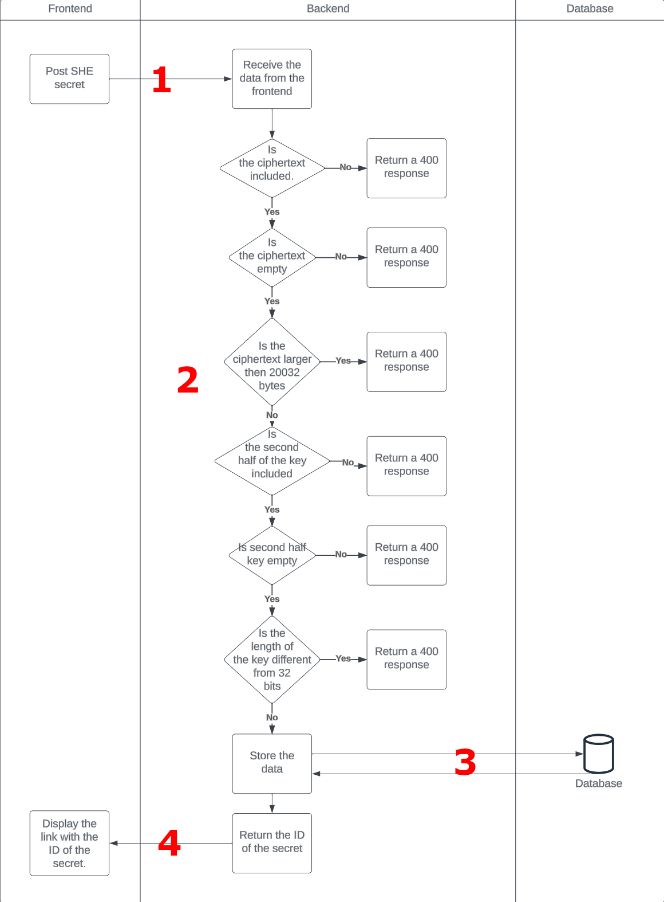
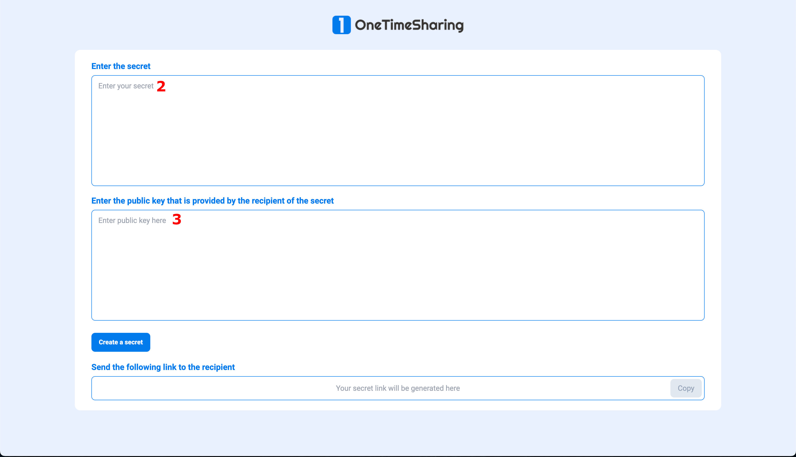
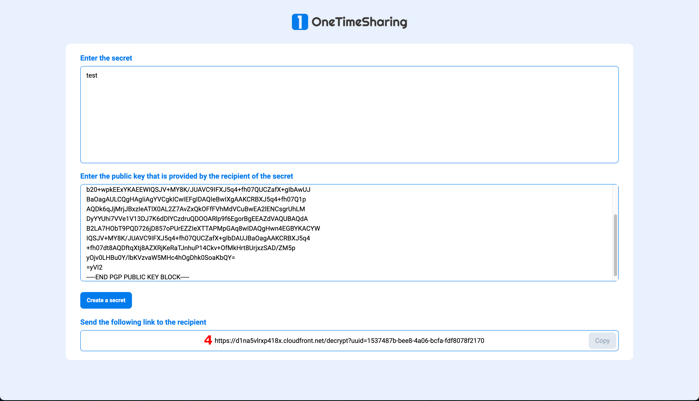

<p align="center">

</p>
<h3 align="center">Safely share your secrets.</h3>

# Usage guide

## Table of Contents

- [Types](#different-types)
- [Second-half encryption](#second-half-encryption)
  - [How do we handle your SHE secret?](#how-do-we-handle-your-she-secret)
  - [Fething a secret](#fetching-a-secret-valid-for-both-encryption-types)
- [Keypair encryption](#publicprivate-key-encryption)
  - [How do we handle your E2E secret?](#how-do-we-handle-your-e2e-secret)
  - [Fething a secret](#fetching-a-secret-valid-for-both-encryption-types-1)
- [Routes](#routes)

## Different types

In this application we work with 2 different types of encryption, SHE encryption and PKI encryption.

- SHE encryption (or second-half encryption): Uses the AES-256 encryption algorithm and stores one half of the decryption key in the database the other half of the key and the IV in the URL parameters. This ensures ease of use for the receiver of the secret as well as being secure as the server only knows half of the key and is missing the IV to decrypt the secret.
- PKI encryption (or Public/Private key encryption): Uses the OpenPGP encryption standard and is used for optimal security. The receiver of the client generates a keypair and stores their private key and passphrase locally, then sends the generated public key to the sender of the secret and he can use this key to encrypt the secret. A link will be generated and can be sent back to the receiver who can decrypt the secret with their private key/passphare combination. This is a little less user friendly but also a bit more secure. As ONLY the receiver of the secret has the necessary parts to decrypt the secret which in turn guarantees (if the pair is kept secure) that the encrypted secret cannot be decrypted by anyone else.

## Second-half encryption

In the encrypt route, you can enter a secret **[1]** and then generate a link. This in turn will generate an encryption key and an IV which is then split. Half of the key is sent to the server along with the encrypted text and the other half along with the IV is stored in the URL parameters along with the ID from the response. A link is generated and displayed including the half of the encryption key and the IV like mentioned above and needs to be copied and sent to the receiver of the secret **[2]**. With this link the secret is retrieved from the server and with the half of the key that is retrieved, the secret is automatically decrypted with the URL parameters in combination with the half of the key that is retrieved **[3]**. The first_half_key and the iv parameter are hash parameters, this means that these params are never sent to any server and are only available client-side so that the server has not enough knowledge to decrypt a secret stored on the server.


### How do we handle your SHE secret?

1. In this part of the flow a request is sent from the frontend to the backend, since the encryption of the secret is always handled client-side there is no plain text sent to the server. Instead in a SHE request the secret is encrypted client-side only the ciphertext and the second half of the encryption key is sent to the server. So the payload of the request to the server will look somthing like this.

```json
{
	"cyphertext": "nPzPuE0gERShjwmjHtEuMQ==",
	"second_half_key": "932e2c06b00b7d4ac624fcbfb727bf4a"
}
```

2. Based on this response a couple of checks need to be executed, mainly about the length of the secret as well as the length of the key. The checks of the ciphertext are identical to the ones above, but we also include checks if there is a key included, the key is not empty and the key is exactly 32 bits long. As the full encryption key is 64 bits.
3. If these checks pass, the cyphertext and second_half_key is stored in the database and the ID of these values is returned.
4. This ID is returned to the frontend and is used to generate a link to the decryption page with this ID in the URL parameters as well as the first half of the key and the IV of the encryption.



### Fetching a secret (Valid for both encryption types)

1. For the fetching of the secrets a request is sent from the frontend to the backend with the ID of the secret included.
2. The backend will then check if the value exists and will otherwise return a 400 error.
3. The second_half_key and the cyphertext is retrieved from the server and sent back to the frontend.
4. The cyphertext will be decrypted using the second_half_key and the first_half_key client-side.


## Public/Private key encryption

In the root route, a keypair generation tool is provided that generates a keypair based on the passphrase entered **[1]**. This keypair is only generated on the client-side and is never sent to the server in any way. Once a keypair is generated the /encrypt route provides an input field for the secret that needs to be encrypted **[2]** as well as a field where the public key needs to be entered in order to encrypt the key **[3]**. If the combination of secret/public key is entered, a the encrypted text is sent to the database and the ID of the retrieved secret is returned and generated into a hyperlink **[4]**. When this link is entered the encrypted secret is sent back from the server **[5]** to the client and the passphrase/private key needs to be entered in order to decrypt the secret **[6][7]**. The secret will then be decrypted client-side and displayed. So that the server never has any knowledge on how to decrypt the secret.






### How do we handle your E2E secret?

1. In this part of the flow a request is sent from the frontend to the backend, since the encryption of the secret is always handled client-side only the ciphertext needs to be sent to the backend. So the payload of the request to the server will look somthing like this.

```json
{
    cyphertext: "-----BEGIN PGP MESSAGE-----wV4DruSh2egv+fgSAQdAmG5hJf32xNijfbvU9EpjrGUA7pmjQ6uSfsQzQRC/
7WwwQqdg96TXJtzOa1ymXvUhwrOVZhC5jOAcK4jbmGFADMm/IKgUMu5am2rB
xJzRusog0jUBYErYrIOIvZhRt2rdZE0XxlIIPKEwc3LP8E3rjxs1vHHQzxo9
yPEPkvELWrrPDReAQ+CsLA==
=r2D3-----END PGP MESSAGE-----"
}
```

2. Based on this response a couple of checks need to be executed, mainly about the length of the secret. We want to make sure we don't store any empty data in the database so we check if the object includes a cyphertext and also if this text is not empty. We also decided on a maximum length of 10MB so a check is used to confirm the encrypted version of this text does not exceed 20MB.
3. If these checks pass, the cyphertext is stored in the database and the ID of this record is returned.
4. This ID is returned to the frontend and is used to generate a link to the decryption page with this ID in the URL parameters.


### Fetching a secret (Valid for both encryption types)

1. For the fetching of the secrets a request is sent from the frontend to the backend with the ID of the secret included.
2. The backend will then check if the value exists and will otherwise return a 400 error.
3. The cyphertext is retrieved from the server and sent back to the frontend.
4. The cyphertext will be decrypted client-side.


## Routes

| Routes          | Type                                     | Description                                                       |
| --------------- | ---------------------------------------- | ----------------------------------------------------------------- |
| **/**           | [**E2E**](#publicprivate-key-encryption) | OpenPGP Keypair generator                                         |
| **/encrypt**    | [**E2E**](#publicprivate-key-encryption) | Encrypt a secret using an OpenPGP public key.                     |
| **/decrypt**    | [**E2E**](#publicprivate-key-encryption) | Decrypt an OpenPGP encryped message using an OpenPGP private key. |
| **/encryptshe** | [**SHE**](#second-half-encryption)       | Encrypt a secret with the AES-256 encryption algorithm.           |
| **/decryptshe** | [**SHE**](#second-half-encryption)       | Decrypt a secret with the AES-256 encryption algorighm.           |
