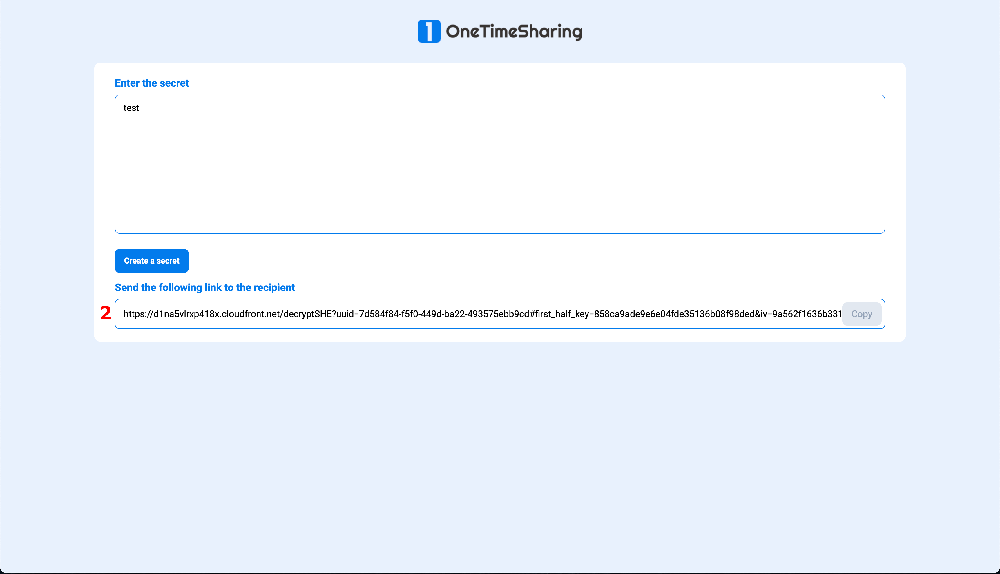
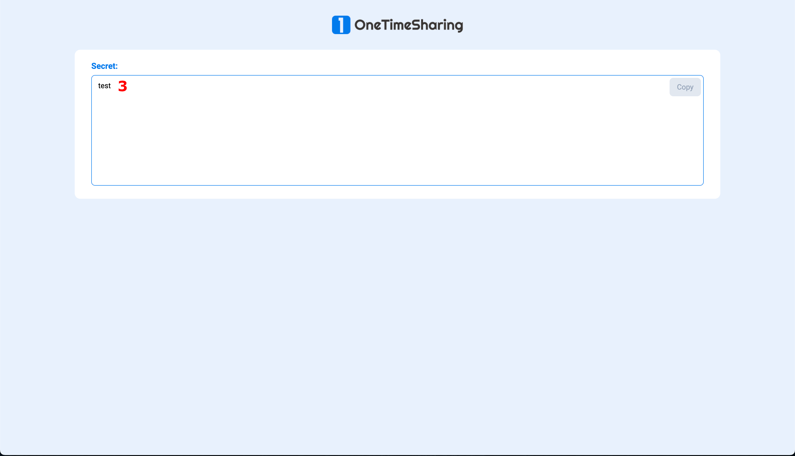
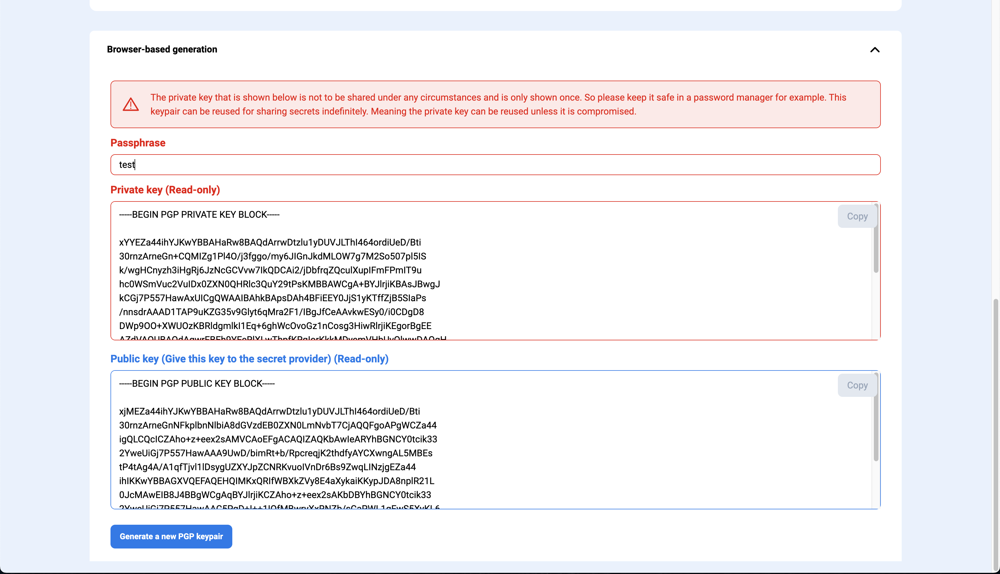
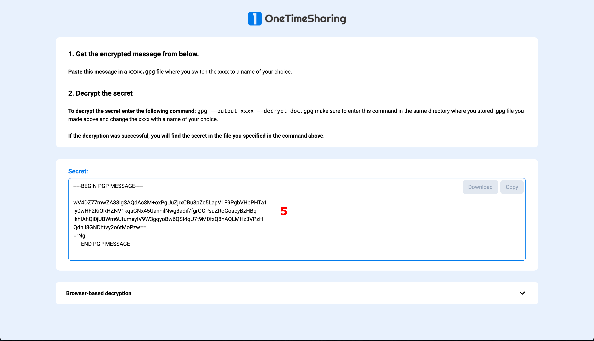
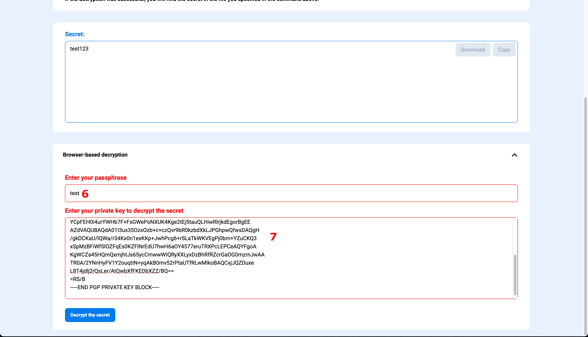
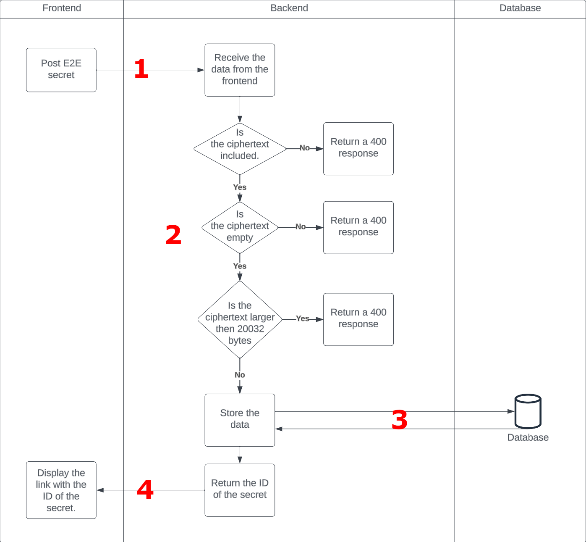

<h3 align="center">Safely share your secrets.</h3>

# Usage guide

## Table of Contents

- [Types](#different-types)
- [Second-half encryption](#second-half-encryption)
- [Keypair encryption](#publicprivate-key-encryption)
- [Routes](#routes)
- [How do we handle your secret](#how-we-handle-the-secrets)

## Different types

In this application we work with 2 different types of encryption, SHE encryption and PKI encryption.

- SHE encryption (or second-half encryption): Uses the AES-256 encryption algorithm and stores one half of the decryption key in the database the other half of the key and the IV in the URL parameters. This ensures ease of use for the receiver of the secret as well as being secure as the server only knows half of the key and is missing the IV to decrypt the secret.
- PKI encryption (or Public/Private key encryption): Uses the OpenPGP encryption standard and is used for optimal security. The receiver of the client generates a keypair and stores their private key and passphrase locally, then sends the generated public key to the sender of the secret and he can use this key to encrypt the secret. A link will be generated and can be sent back to the receiver who can decrypt the secret with their private key/passphare combination. This is a little less user friendly but also a bit more secure. As ONLY the receiver of the secret has the necessary parts to decrypt the secret which in turn guarantees (if the pair is kept secure) that the encrypted secret cannot be decrypted by anyone else.

## Second-half encryption

In the encrypt route, you can enter a secret **[1]** and then generate a link. This in turn will generate an encryption key and an IV which is then split. Half of the key is sent to the server along with the encrypted text and the other half along with the IV is stored in the URL parameters along with the ID from the response. A link is generated and displayed including the half of the encryption key and the IV like mentioned above and needs to be copied and sent to the receiver of the secret **[2]**. With this link the secret is retrieved from the server and with the half of the key that is retrieved, the secret is automatically decrypted with the URL parameters in combination with the half of the key that is retrieved **[3]**.

## Public/Private key encryption

In the root route, a keypair generation tool is provided that generates a keypair based on the passphrase entered **[1]**. This keypair is only generated on the client-side and is never sent to the server in any way. Once a keypair is generated the /encrypt route provides an input field for the secret that needs to be encrypted **[2]** as well as a field where the public key needs to be entered in order to encrypt the key **[3]**. If the combination of secret/public key is entered, a the encrypted text is sent to the database and the ID of the retrieved secret is returned and generated into a hyperlink **[4]**. When this link is entered the encrypted secret is sent back from the server **[5]** to the client and the passphrase/private key needs to be entered in order to decrypt the secret **[6][7]**. The secret will then be decrypted client-side and displayed. So that the server never has any knowledge on how to decrypt the secret.

## Routes

| Routes          | Type                                     | Description                                                       |
| --------------- | ---------------------------------------- | ----------------------------------------------------------------- |
| **/**           | [**E2E**](#publicprivate-key-encryption) | OpenPGP Keypair generator                                         |
| **/encrypt**    | [**E2E**](#publicprivate-key-encryption) | Encrypt a secret using an OpenPGP public key.                     |
| **/decrypt**    | [**E2E**](#publicprivate-key-encryption) | Decrypt an OpenPGP encryped message using an OpenPGP private key. |
| **/encryptshe** | [**SHE**](#second-half-encryption)       | Encrypt a secret with the AES-256 encryption algorithm.           |
| **/decryptshe** | [**SHE**](#second-half-encryption)       | Decrypt a secret with the AES-256 encryption algorighm.           |

## How we handle the secrets

To provide some more transparency for non-developers, we decided to provide these flowcharts with some explanation on how we handle your secrets. We will start with how a E2E is stored in the database.

